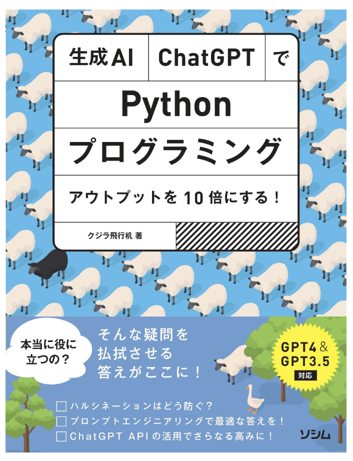

# 書籍「生成AI・ChatGPTでPythonプログラミング」のサンプルプログラム

- 書名: 生成AI・ChatGPTでPythonプログラミング アウトプットを10倍にする！GPT4&GPT3.5対応
- 筆者: クジラ飛行机
- 出版社 : ソシム (2023/8/2)
- 発売日 : 2023/8/2
- 単行本 : 320ページ
- ISBN-10 : 4802614209
- ISBN-13 : 978-4802614207
- 購入→ [Amazon](https://amzn.to/42QN4jB)

